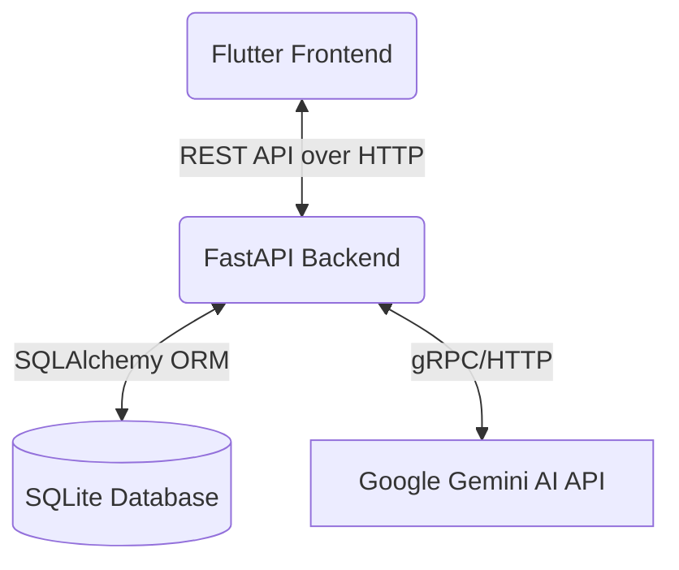

# System Architecture

The **Flodo Task Manager** is a decoupled full-stack application consisting of a mobile/web frontend built in Flutter and a REST API backend powered by FastAPI (Python).

---

## 🏗️ High-Level System Overview

### 1. The Frontend (Flutter Client)

- Located in the `flodo_frontend/` directory.
- **State Management:** Uses the `Provider` pattern (`lib/providers/`) to maintain the application's global state and track task changes.
- **Services:** API interactions reside inside `lib/services/`. This layer makes standard HTTP requests to our FastAPI backend (`http://localhost:8000/tasks`).
- **Models:** Dart models in `lib/models/` map 1:1 to the JSON format returned by the FastAPI backend to ensure type-safety mapping.
- **UI Architecture:** Custom widgets and polished Material/Cupertino hybrid components (`lib/screens/`) render a modern interface using glassmorphic UI patterns.

### 2. The Backend (Python FastAPI)

The backend exposes a highly responsive and asynchronous REST API, localized in the `backend/` space. 

#### File Structure & Responsibilities

- **`main.py`**: The entry point. Handles routing, middleware configurations (CORS), and HTTP endpoints for CRUD logic as well as AI.
- **`database.py`**: Configures the SQLAlchemy engine and `SessionLocal` for connection pooling with SQLite.
- **`models.py`**: Defines the raw SQLAlchemy Database mapping (`Task` object), representing how data sits inside the SQL tables.
- **`schemas.py`**: Defines Pydantic validation models. Ensures data coming from the user request is strictly structured, and handles response serialization seamlessly.

#### Feature Deep Dive: AI Integration (Gemini AI)
The project utilizes the `google-genai` SDK and the `gemini-2.5-flash` model. Prompts are heavily structured via zero-shot prompting techniques to ensure strict JSON responses from the GenAI model:
- `POST /tasks/ai/generate`: Translates a user prompt into 3 structured sub-tasks. The backend extracts the markdown JSON, parses it, and creates the models in the db instantly.
- `POST /tasks/ai/polish`: Taking an existing bad title and description, the AI reformats it into professional English, returning a strict payload.

#### Feature Deep Dive: Task Dependencies & Recurrence
- **Dependencies (`blocked_by_id`)**: A task can be assigned a blocker utilizing a self-referential foreign key. The API checks dynamically to prevent a task from blocking itself (`400 Bad Request`).
- **Recurrence**: When an `Update` operation triggers a task with a status transition from `Not Done` → `Done`, the system checks its `recurrence_interval` (Daily or Weekly). If matched, the system automatically creates a duplicate clone positioned exactly 1 day or 1 week into the future.
